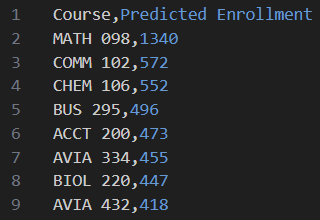

# Enrollment-Projection
# Degree Program DAG Builder (Project Snapshot)

**This repository is a snapshot of a single component extracted from a larger university analytics project.**  
 The code shown here was fully designed and implemented by me and published independently to demonstrate my approach to modeling complex prerequisite logic and academic program structure. The original project included multiple contributors and confidential datasets that are not included in this public snapshot.

## What This Is

This repo contains the **DAG (Directed Acyclic Graph) builder** used to model degree programs and course prerequisites as graphs.  
It takes structured program requirements and course metadata (from CSV inputs) and produces:

- A directed graph of course dependencies  
- Subgraphs for requirement groups (core, gen eds, electives, etc.)  
- DOT output for Graphviz  
- Interactive HTML visualizations using PyVis  

This component was developed by me as part of a larger system that forecasted **future course demand** by simulating which courses students are likely to take next.

## Original Project Context (High-Level)

The full project was built for **Minnesota State University, Mankato** to help administrators better predict course demand and plan scheduling and staffing. At a high level, the system:

1. Ingested anonymized student records and program requirements  
2. Modeled degree programs as graphs (this repo’s component)  
3. Traversed those graphs using each student’s academic history  
4. Aggregated likely next courses across all students  
5. Produced enrollment projections to support scheduling and budgeting decisions  

This public repo isolates the **program modeling layer** only. Student data pipelines, forecasting logic, and confidential datasets are intentionally excluded.

## What I Personally Built

I was solely responsible for the design and implementation of the **DAGBuilder** module, including:

- Parsing prerequisite strings into structured dependency graphs  
- Supporting AND / OR logic and credit-based requirements  
- Handling subgraphs for degree requirement groupings  
- Detecting missing or non-offered courses  
- Exporting graphs to DOT and interactive HTML  
- Designing the internal node/edge schema and traversal logic  

This snapshot reflects my individual engineering work, extracted and sanitized from the original codebase.

## Features

- Builds directed graphs of degree requirements using NetworkX  
- Recursively expands prerequisites  
- Supports OR-nodes and credit-based requirement nodes  
- Flags courses missing from the database  
- Exports:
  - Graphviz DOT files  
  - Interactive HTML visualizations (PyVis)

## Data & Privacy

The original project used **confidential university data**, which is **not included here**.

This repo includes CSVs with the required schemas to run the DAG builder, but the data has been reduced and modified for privacy.  

## Example Output (From the Full System)

This repository also includes a small example of what the **final output of the full, original system** might look like.

The `OutputData/PredictedValues.csv` file shows a simplified version of the aggregated course demand output produced by the complete pipeline (after student traversal and tallying). In the original project, this output was generated by running all students through their program DAGs and summing the courses they were likely to take next.

The data included here is **synthetic and reduced** for demonstration purposes only. It exists to illustrate the format and intent of the final output, not to represent real student data or actual enrollment predictions.



Example of what the final enrollment projection output looked like after aggregating results across programs (synthetic data).

## Running the Project

### 1. Clone the repository
```
git clone <repo-url>
cd Enrollment-Projection
```
### 2. Create and activate a virtual environment
Windows (PowerShell):
```
py -m venv .venv
.\.venv\Scripts\Activate.ps1
```
macOS/Linux:
```
python3 -m venv .venv
source .venv/bin/activate
```
### 3. Install dependencies
```
python -m pip install -r requirements.txt
```
### 4. Run the DAG builder
```
python datastructures/DAGBuilder.py
```
### 5. View results
Output files are saved to the dag/ folder.
